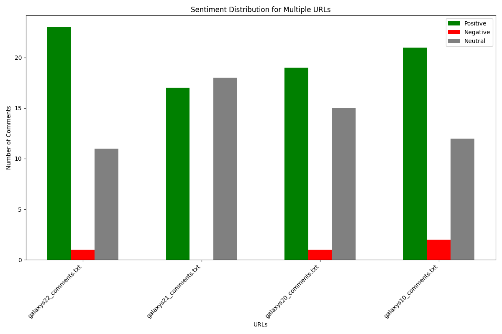

# Sentiment Analyzer

## Setup - Installing required packages

- Create a new conda environment for your project:
  - conda create env --*env name* python=3.9
  - conda activate *env name*

- Install Hugging Face CLI:
  - pip install huggingface-hub>=0.17.1

- Login to Hugging Face:
  huggingface-cli login

- Download the GGUF model:
  - huggingface-cli download microsoft/Phi-3-mini-4k-instruct-gguf Phi-3-mini-4k-instruct-q4.gguf --local-dir . --local-dir-use-symlinks False

- Install llama-cpp-python:
  - $env:CMAKE_GENERATOR = "MinGW Makefiles"
  - $env:CMAKE_ARGS = "-DGGML_OPENBLAS=on -DCMAKE_C_COMPILER=*file path for gcc*-DCMAKE_CXX_COMPILER=*file path for g++*"
  - pip install llama-cpp-python

- Install Web scrapping packages
    - pip install beautifulsoup4
    - pip install requests

- Install matplotlib
    - pip install matplotlib.pyplot

- Install pytest
    - pip install pytest

 
  

